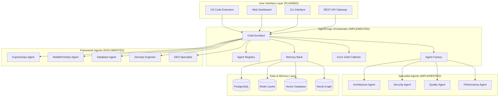
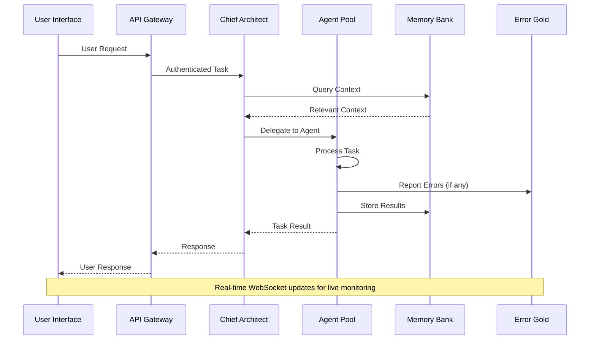
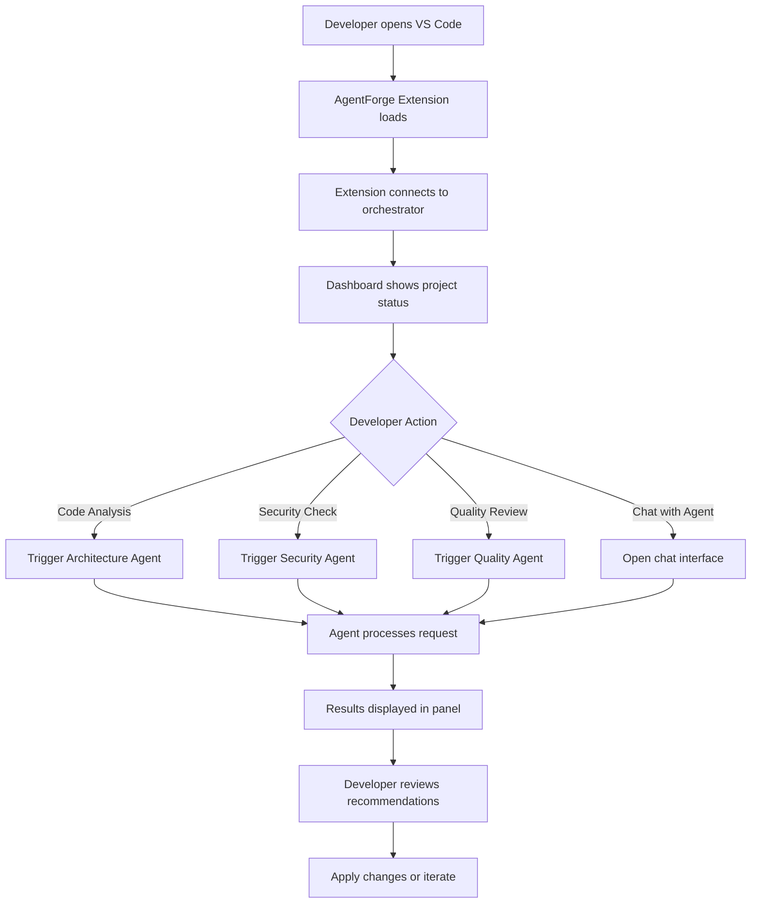
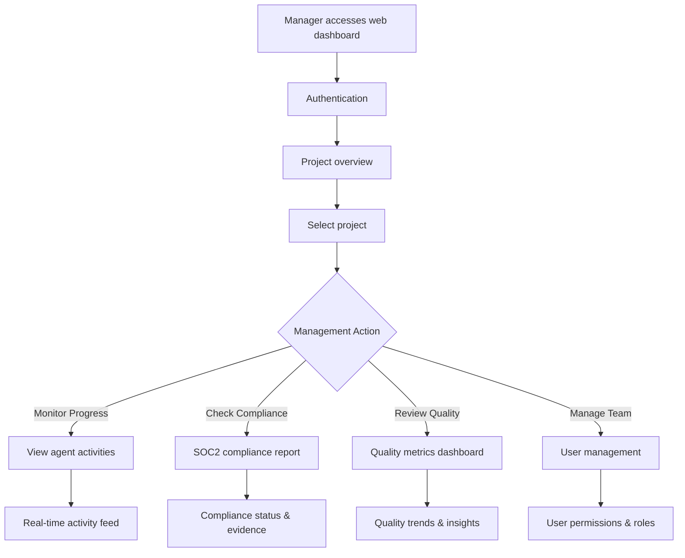

# Tronagenticstar Project: Complete Interface Architecture & Frontend Strategy

## 📖 Executive Summary

The **Tronagenticstar (AgentForge/Constella)** project is a comprehensive multi-agent orchestration platform designed to revolutionize software development through AI-powered agent collaboration. This document provides a detailed analysis of the current project state, interface options, and comprehensive frontend strategy for connecting users to the agent ecosystem.

---

## 🏗️ Current Project Architecture

### Core System Overview



### Project Structure Analysis

```
d:\My-Projects\Tronagenticstar-master/
├── 📁 packages/
│   └── orchestrator/               # ✅ IMPLEMENTED - Core orchestration engine
│       ├── src/
│       │   ├── agent.ts           # Base agent interface
│       │   ├── chiefArchitect.ts  # Main orchestrator
│       │   ├── agentRegistry.ts   # Agent management
│       │   ├── memoryBank.ts      # Memory & context management
│       │   ├── errorGold.ts       # Error handling & circuit breaker
│       │   ├── agentFactory.ts    # Agent lifecycle management
│       │   ├── concreteAgents.ts  # Specialist agent implementations
│       │   └── example.ts         # Demo & usage examples
│       └── dist/                  # Compiled TypeScript output
│
├── 📁 frameworks/                  # ✅ DOCUMENTED - Agent frameworks
│   ├── agentforge/                # Core AgentForge documentation
│   ├── Laravelbackendcraft.mdc   # Laravel backend agent
│   ├── nextjs-errorgold-framework.mdc
│   ├── SecureStackPhp.mdc        # PHP security framework
│   ├── devopsEngineerFramework.mdc
│   ├── seoSpecialistFramework.mdc
│   └── universal-errorgold-framework.md
│
├── 📁 docs/                       # ✅ DOCUMENTED - Product & architecture docs
│   ├── prd.md                     # Product Requirements Document
│   ├── webprd.md                  # Web frontend requirements
│   ├── status.md                  # Current project status
│   ├── roadmap.md                 # Development roadmap
│   └── adr/                       # Architecture Decision Records
│
├── 📁 Docs2/                      # ✅ DOCUMENTED - Extended documentation
│   ├── egsoc2complinace.md       # Enterprise SOC2 compliance guide
│   ├── soc2compliance.md         # SOC2 implementation details
│   ├── cheifarchitect.md         # Chief Architect specifications
│   └── techstack1.md             # Technology stack details
│
├── 📁 website/                    # ❌ EMPTY - Frontend placeholder
└── 📁 venvagents/                 # ❌ EMPTY - Agent environments
```

---

## 🖥️ Interface Connection Strategy

### 1. Primary Interface Options

#### Option A: VS Code Extension (RECOMMENDED PRIMARY)
```typescript
// VS Code Extension Architecture
interface VSCodeExtension {
  panels: {
    agentActivity: "Real-time agent action feed",
    chatInterface: "Direct agent communication",
    projectDashboard: "Insights and metrics",
    settings: "Agent configuration"
  },
  integration: {
    workspace: "Direct code access",
    git: "Version control integration",
    terminal: "Command execution",
    debugging: "Error tracking integration"
  },
  communication: {
    protocol: "WebSocket to orchestrator",
    authentication: "JWT tokens",
    encryption: "TLS 1.3"
  }
}
```

**Benefits:**
- Direct IDE integration
- Seamless developer workflow
- Code context awareness
- Existing VS Code ecosystem

**Implementation Path:**
1. Create VS Code extension manifest
2. Implement webview panels
3. WebSocket connection to orchestrator
4. Agent communication interface

#### Option B: Web Dashboard (RECOMMENDED SECONDARY)
```typescript
// Web Dashboard Architecture
interface WebDashboard {
  framework: "Next.js 14 + TypeScript",
  ui: "Tailwind CSS + Radix UI",
  features: {
    agentManagement: "Register, configure, monitor agents",
    projectOverview: "Multi-project management",
    realTimeMonitoring: "Live agent activity",
    analyticsReporting: "Performance metrics",
    complianceTracking: "SOC2 compliance status"
  },
  authentication: "Auth0 or Clerk",
  deployment: "Vercel with edge functions"
}
```

**Benefits:**
- Cross-platform accessibility
- Rich visualization capabilities
- Project management features
- Multi-user collaboration

**Implementation Path:**
1. Next.js application setup
2. API routes for orchestrator communication
3. Real-time UI with WebSockets
4. Dashboard components and analytics

#### Option C: CLI Interface (UTILITY)
```bash
# CLI Commands Structure
agentforge init <project-name>           # Initialize new project
agentforge agents list                   # List available agents
agentforge agents deploy <agent-type>    # Deploy specific agent
agentforge task create <task-type>       # Create new task
agentforge status                        # System health check
agentforge logs <agent-id>               # View agent logs
agentforge config set <key> <value>      # Configuration management
```

**Benefits:**
- CI/CD integration
- Scripting and automation
- Lightweight operation
- DevOps-friendly

#### Option D: REST API Gateway (INFRASTRUCTURE)
```typescript
// API Gateway Structure
interface APIGateway {
  endpoints: {
    "/api/v1/agents": "Agent management",
    "/api/v1/tasks": "Task management",
    "/api/v1/health": "System health",
    "/api/v1/metrics": "Performance metrics",
    "/api/v1/compliance": "SOC2 compliance data"
  },
  authentication: "JWT + API keys",
  rateLimit: "Per-user quotas",
  documentation: "OpenAPI/Swagger"
}
```

### 2. Integration Architecture



---

## 🚀 Recommended Implementation Roadmap

### Phase 1: Core API Gateway (2-3 weeks)
```typescript
// Priority: HIGH
tasks: [
  "Create REST API server (Express.js + TypeScript)",
  "Implement JWT authentication",
  "Add WebSocket support for real-time updates",
  "Create OpenAPI documentation",
  "Add rate limiting and security middleware",
  "Health check and metrics endpoints"
]
```

### Phase 2: VS Code Extension (3-4 weeks)
```typescript
// Priority: HIGH - Primary developer interface
tasks: [
  "VS Code extension scaffolding",
  "Agent activity panel implementation",
  "Chat interface with agents",
  "Project dashboard with metrics",
  "Settings and configuration UI",
  "Extension marketplace publishing"
]
```

### Phase 3: Web Dashboard (4-5 weeks)
```typescript
// Priority: MEDIUM - Management interface
tasks: [
  "Next.js application setup",
  "Authentication system (Auth0/Clerk)",
  "Agent management interface",
  "Real-time monitoring dashboard",
  "Analytics and reporting",
  "SOC2 compliance tracking UI"
]
```

### Phase 4: CLI Tool (2 weeks)
```typescript
// Priority: LOW - Automation interface
tasks: [
  "CLI application (Node.js)",
  "Command structure implementation", 
  "Configuration management",
  "CI/CD integration examples",
  "Package publication (npm)"
]
```

---

## 🛠️ Technical Implementation Details

### Frontend Technology Stack

#### VS Code Extension
```json
{
  "technologies": {
    "framework": "VS Code Extension API",
    "language": "TypeScript",
    "ui": "Webview API + React",
    "styling": "CSS Modules + Tailwind",
    "communication": "WebSocket + REST API",
    "packaging": "vsce (VS Code Extension CLI)"
  },
  "dependencies": {
    "vscode": "^1.74.0",
    "react": "^18.2.0",
    "socket.io-client": "^4.7.0",
    "axios": "^1.4.0"
  }
}
```

#### Web Dashboard
```json
{
  "technologies": {
    "framework": "Next.js 14",
    "language": "TypeScript", 
    "ui": "React + Tailwind CSS + Radix UI",
    "state": "Zustand + React Query",
    "charts": "Recharts + D3.js",
    "authentication": "Auth0 or Clerk",
    "deployment": "Vercel"
  },
  "features": {
    "realTime": "Socket.io or Server-Sent Events",
    "analytics": "Custom dashboard with metrics",
    "compliance": "SOC2 tracking interface",
    "agents": "Agent lifecycle management UI"
  }
}
```

### Backend API Structure

```typescript
// API Server Implementation
class AgentForgeAPIServer {
  routes: {
    // Agent Management
    "GET /api/v1/agents": "List all agents",
    "POST /api/v1/agents": "Register new agent", 
    "GET /api/v1/agents/:id": "Get agent details",
    "PUT /api/v1/agents/:id": "Update agent configuration",
    "DELETE /api/v1/agents/:id": "Unregister agent",
    
    // Task Management
    "POST /api/v1/tasks": "Create new task",
    "GET /api/v1/tasks": "List tasks",
    "GET /api/v1/tasks/:id": "Get task details",
    "PUT /api/v1/tasks/:id/cancel": "Cancel task",
    
    // Memory & Context
    "GET /api/v1/memory/context": "Query context",
    "POST /api/v1/memory/store": "Store context",
    
    // System Health
    "GET /api/v1/health": "System health check",
    "GET /api/v1/metrics": "Performance metrics",
    "GET /api/v1/compliance": "SOC2 compliance status",
    
    // Real-time
    "WS /api/v1/events": "WebSocket for real-time updates"
  }
}
```

---

## 📊 User Experience Flow

### Developer Workflow (VS Code Extension)



### Project Manager Workflow (Web Dashboard)



---

## 🔒 Security & Compliance Integration

### Authentication Architecture
```typescript
interface AuthenticationSystem {
  methods: {
    jwt: "Primary authentication method",
    apiKeys: "Service-to-service authentication",
    oauth2: "Third-party integrations",
    mfa: "Multi-factor authentication"
  },
  authorization: {
    rbac: "Role-based access control",
    permissions: "Granular permission system",
    scopes: "API scope limitations"
  },
  compliance: {
    soc2: "SOC2 Type II compliance",
    gdpr: "GDPR compliance for EU users",
    audit: "Complete audit trail"
  }
}
```

### SOC2 Compliance Interface
```typescript
interface ComplianceInterface {
  monitoring: {
    controlTracking: "Real-time control monitoring",
    evidenceCollection: "Automated evidence gathering",
    riskAssessment: "Continuous risk evaluation",
    incidentTracking: "Security incident management"
  },
  reporting: {
    dashboard: "Compliance status dashboard",
    reports: "Automated compliance reports",
    alerts: "Non-compliance notifications",
    export: "Evidence export for auditors"
  }
}
```

---

## 🎯 Success Metrics & KPIs

### Technical Metrics
```yaml
performance:
  - response_time: "<200ms for 95% of requests"
  - availability: ">99.9% uptime"
  - scalability: "Support 1000+ concurrent users"
  - reliability: "<0.1% error rate"

user_experience:
  - onboarding_time: "<5 minutes to first task"
  - task_completion_rate: ">95%"
  - user_satisfaction: ">4.5/5 rating"
  - feature_adoption: ">80% for core features"

business:
  - agent_productivity: "50% reduction in development time"
  - quality_improvement: "90% reduction in bugs"
  - compliance_efficiency: "80% automation of compliance tasks"
  - cost_reduction: "40% reduction in operational costs"
```

---

## 🔮 Future Enhancements

### Advanced Interface Features
```typescript
interface FutureFeatures {
  ai_interactions: {
    voice_commands: "Voice-controlled agent interactions",
    natural_language: "Natural language task creation",
    predictive_suggestions: "AI-powered recommendations"
  },
  collaboration: {
    real_time_collaboration: "Multi-developer real-time editing",
    shared_workspaces: "Team workspace management",
    communication_hub: "Integrated team communication"
  },
  analytics: {
    advanced_insights: "ML-powered project insights",
    predictive_analytics: "Future issue prediction",
    optimization_recommendations: "Performance optimization AI"
  }
}
```

### Mobile Interface
```typescript
interface MobileApp {
  platform: "React Native or Flutter",
  features: {
    monitoring: "Monitor agent activities on mobile",
    notifications: "Push notifications for critical events",
    approval_workflow: "Mobile approval for sensitive operations",
    dashboard: "Mobile-optimized dashboard"
  }
}
```

---

## 🚀 Getting Started Guide

### For Developers (Quick Start)

1. **Install VS Code Extension** (When available)
```bash
# Install from VS Code marketplace
# Or develop locally:
git clone https://github.com/your-org/agentforge-vscode
cd agentforge-vscode
npm install
npm run dev
```

2. **Setup API Gateway**
```bash
cd packages/orchestrator
npm install
npm run build
npm start

# API will be available at http://localhost:3000
```

3. **Connect and Test**
```typescript
// Test agent connection
const response = await fetch('http://localhost:3000/api/v1/health');
const health = await response.json();
console.log('AgentForge Status:', health);
```

### For Project Managers

1. **Access Web Dashboard** (When available)
   - Navigate to `https://dashboard.agentforge.dev`
   - Login with organization credentials
   - Setup project workspace

2. **Configure Agents**
   - Enable required agent types
   - Set compliance requirements
   - Configure notification preferences

3. **Monitor Progress**
   - View real-time agent activities
   - Track compliance status
   - Review quality metrics

---

## 📞 Conclusion & Next Steps

The Tronagenticstar project has a **solid foundation** with the orchestrator core implemented and comprehensive documentation. The immediate priority should be:

### Immediate Actions (Next 2 weeks)
1. **Complete VS Code Extension MVP** - Primary developer interface
2. **Implement API Gateway** - Enable external connections
3. **Create Web Dashboard MVP** - Management interface
4. **Add WebSocket support** - Real-time updates

### Strategic Focus
- **Developer Experience**: Make it seamless to interact with agents
- **Enterprise Features**: SOC2 compliance, security, scalability
- **User Adoption**: Intuitive interfaces and clear value proposition
- **Ecosystem Growth**: Plugin architecture for custom agents

The project is well-positioned to revolutionize software development through AI agent orchestration. The multi-interface approach ensures accessibility for different user types while maintaining enterprise-grade security and compliance standards.

---

*Document Version: 1.0*  
*Last Updated: January 2025*  
*Author: AgentForge Team*
