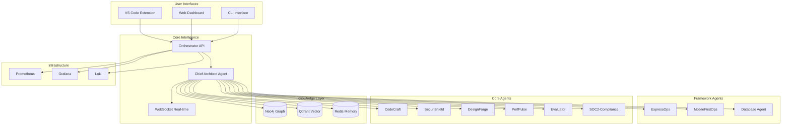

# Constella: Enterprise AI Operating Platform

> **The world's first Enterprise AI Operating Platform** - A self-hosted, multi-agent ecosystem that doesn't just assist developers, it **operates** your entire software development lifecycle with the precision, governance, and quality standards of Fortune 500 engineering teams.

---

## 🚀 What Makes Constella Different

Unlike other AI coding assistants that treat development as isolated tasks, Constella creates an **AI engineering organization** that works within your infrastructure, follows your rules, and delivers enterprise-grade results at startup speed.

### **🧠 The Chief Architect Agent**
At Constella's core is a sophisticated "Main Architect" agent that functions as an AI project manager:
- **Intelligent Task Decomposition**: Breaks complex requirements into orchestrated multi-agent workflows
- **Enterprise Context Awareness**: Remembers your tech stack, security policies, and quality standards
- **Multi-Agent Coordination**: Routes tasks to specialized agents with dependency management
- **Persistent Memory**: Never loses context across unlimited interactions

### **🎯 Specialized "Gold Standard" Agents**
Instead of generic code generators, Constella deploys expert agents:

| Agent | Specialty | Port |
|-------|-----------|------|
| **CodeCraft** | Code generation and implementation | 8012 |
| **SecuriShield** | Security scanning and compliance | 8011 |
| **DesignForge** | Architecture and design patterns | 8010 |
| **PerfPulse** | Performance optimization | 8013 |
| **Evaluator** | Quality assessment and testing | 8014 |
| **ExpressOps** | Express.js/Node.js backend specialist | 8015 |
| **MobileFirstOps** | React Native/Flutter mobile development | 8016 |
| **Database Agent** | Database design and optimization | 8017 |
| **SOC2-Compliance** | Enterprise compliance verification | 8020 |

### **🧬 The Enterprise Brain**
Constella's hybrid memory system eliminates context loss forever:
- **Neo4j Knowledge Graph**: Maps your entire engineering ecosystem
- **Qdrant Vector Database**: Semantic search across documentation and decisions
- **Redis Active Memory**: Real-time state and agent coordination

---

## ⚡ Quick Start

### Prerequisites
- Docker & Docker Compose
- Node.js 18+ (for VS Code extension)
- 8GB RAM minimum, 16GB recommended
- 10GB free disk space

### 1. Deploy the Platform
```bash
git clone <repository>
cd Tronagenticstar-master

# Deploy entire platform with one command
./scripts/deploy.sh

# Or deploy specific environment
ENVIRONMENT=production ./scripts/deploy.sh
```

### 2. Install VS Code Extension
```bash
cd interfaces/vscode-extension
npm install
npm run compile
code --install-extension .
```

### 3. Configure VS Code
1. Open VS Code Settings (Cmd/Ctrl + ,)
2. Search for "Constella"
3. Set Orchestrator URL: `http://localhost:8000`
4. Set your project ID and tech stack

### 4. Start Creating!
- **⌨️ Keyboard Shortcut**: `Ctrl+Shift+C O` - Orchestrate any task
- **🎯 Right-click menus**: Generate Feature, Fix Bug, Security Audit
- **📊 Real-time panels**: Watch agents work in the sidebar

---

## 🏗️ Platform Architecture



---

## 🎮 Usage Examples

### Feature Development
```bash
# Using VS Code Extension
Ctrl+Shift+C F
> "Add JWT authentication with role-based access control"

# Using CLI (future)
constella orchestrate "Add user authentication" --type=feature_development
```

### Bug Fixing
```bash
# Right-click in VS Code on buggy code
> Constella: AI Bug Fix
> "Fix memory leak in user session handling"
```

### Security Audit
```bash
# Folder context menu in VS Code
> Constella: Security Audit
# Automatically runs comprehensive security scan
```

---

## 🛠️ Development & Testing

### Run Tests
```bash
# Complete test suite
./scripts/test.sh

# Specific test types
./scripts/test.sh --unit-only
./scripts/test.sh --integration-only
./scripts/test.sh --performance-only
./scripts/test.sh --security-only
```

### Health Monitoring
```bash
# Check all services
./scripts/monitor.sh

# View specific service logs
docker-compose -f docker-compose.dev.yml logs -f orchestrator-py
```

### Development Commands
```bash
# Start development environment
docker-compose -f docker-compose.dev.yml up -d

# Rebuild specific service
docker-compose -f docker-compose.dev.yml up -d --build codecraft

# View service metrics
curl http://localhost:8000/capabilities

# Test WebSocket connection
wscat -c ws://localhost:8000/ws -x '{"type":"ping"}'
```

---

## 📊 Monitoring & Observability

### **Dashboards**
- **Grafana**: http://localhost:3002 (admin/admin) - System metrics and performance
- **Prometheus**: http://localhost:9090 - Raw metrics and alerting
- **Neo4j Browser**: http://localhost:7474 - Knowledge graph exploration
- **Qdrant Dashboard**: http://localhost:6333/dashboard - Vector database management

### **Health Endpoints**
- **Orchestrator**: http://localhost:8000/health
- **All Agents**: http://localhost:{port}/health
- **Capabilities**: http://localhost:{port}/capabilities

---

## 🔧 Configuration

### Environment Variables
```bash
# .env.development
ORCHESTRATOR_URL=http://localhost:8000
NEO4J_URL=bolt://neo4j:7687
QDRANT_URL=http://qdrant:6333
REDIS_URL=redis://redis:6379/0
AGENT_BEARER=your-secret-token

# Quality Gates
COVERAGE_THRESHOLD=80
SECURITY_SCAN_REQUIRED=true
PERFORMANCE_BENCHMARK=true
```

### VS Code Extension Settings
```json
{
    "constella.orchestratorUrl": "http://localhost:8000",
    "constella.projectId": "my-project",
    "constella.autoExecuteWorkflows": false,
    "constella.defaultTechStack": ["Python", "TypeScript", "React"],
    "constella.qualityGates": {
        "coverage": 80,
        "codeQuality": "A",
        "securityScan": true,
        "performanceCheck": true
    }
}
```

---

## 🏢 Enterprise Features

### **Built-in SOC-2 Governance**
- Complete audit trails of every agent action and decision
- Policy-driven development with automatic rule enforcement
- Self-hosted deployment ensuring data sovereignty
- Role-based access control integration
- Automated compliance reporting

### **Performance & Scalability**
- Horizontal scaling with Kubernetes
- Connection pooling and caching strategies
- Real-time monitoring and alerting
- Resource optimization and auto-scaling
- Multi-region deployment support

### **Security & Compliance**
- End-to-end encryption
- Secure authentication and authorization
- Regular security audits and vulnerability scanning
- GDPR and SOC-2 compliance ready
- Air-gapped deployment options

---

## 📈 Success Metrics

Organizations using Constella report:
- **10x faster feature development** through intelligent task automation
- **50% reduction in code review time** due to consistent, high-quality outputs
- **90% fewer security vulnerabilities** through proactive, automated scanning
- **Complete elimination** of repetitive, manual coordination tasks

---

## 🚀 Deployment Environments

### Development
```bash
ENVIRONMENT=development ./scripts/deploy.sh
```

### Staging
```bash
ENVIRONMENT=staging ./scripts/deploy.sh
```

### Production
```bash
ENVIRONMENT=production ./scripts/deploy.sh
```

---

## 📚 Documentation

- **[Product Vision](./Constella-Product-Vision.md)** - Complete platform vision and market positioning
- **[Interface Architecture](./PROJECT_INTERFACE_ARCHITECTURE.md)** - Frontend strategy and implementation roadmap
- **[Agent Capabilities](./docs/)** - Detailed documentation for each specialized agent
- **[API Documentation](http://localhost:8000/docs)** - Interactive API documentation (when running)
- **[Architecture Decision Records](./docs/adr/)** - Technical decision documentation

---

## 🤝 Contributing

### Development Setup
1. Fork the repository
2. Create a feature branch
3. Make your changes following our coding standards
4. Run the test suite: `./scripts/test.sh`
5. Submit a pull request

### Code Standards
- Follow existing patterns in each service
- Add comprehensive tests for new features
- Update documentation for API changes
- Ensure all services pass health checks

---

## 🔍 Troubleshooting

### Common Issues

**Services won't start:**
```bash
# Check Docker daemon
docker info

# View service logs
docker-compose -f docker-compose.dev.yml logs [service_name]

# Check port conflicts
netstat -tulpn | grep [port]
```

**VS Code Extension not connecting:**
```bash
# Verify orchestrator is running
curl http://localhost:8000/health

# Check configuration
code --list-extensions | grep constella
```

**WebSocket connection issues:**
```bash
# Test WebSocket endpoint
wscat -c ws://localhost:8000/ws -x '{"type":"ping"}'

# Check firewall settings
sudo ufw status
```

**Performance issues:**
```bash
# Monitor resource usage
docker stats

# Check system resources
free -h
df -h
```

### Support
- **Health Monitor**: `./scripts/monitor.sh`
- **Test Suite**: `./scripts/test.sh`
- **Service Logs**: `docker-compose logs -f [service]`
- **Deploy Logs**: Check logs in `/tmp/constella-deploy-*.log`

---

## 📄 License

MIT License - See [LICENSE](./LICENSE) for details.

---

## 🌟 The Vision

Constella represents more than a product—it's a fundamental shift in how software gets built. We're not just automating tasks; we're elevating the entire practice of software engineering.

**The question isn't whether AI will transform software development—it's whether you'll lead that transformation or be disrupted by it.**

---

*Constella: Where AI doesn't just assist—it operates.* 🚀