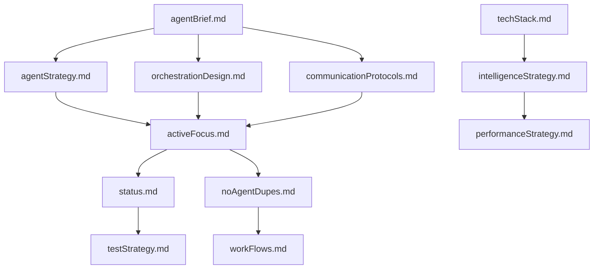
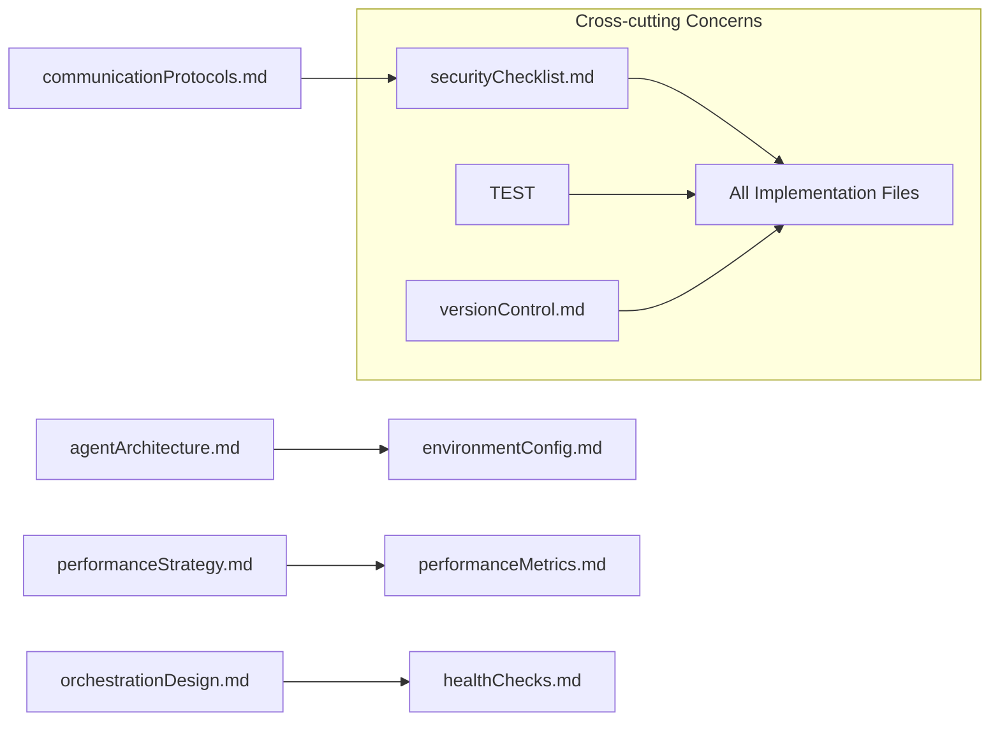

# DEPRECATION NOTICE (2024-06-17)

This monolithic document has been superseded by the modular docs inside `frameworks/agentforge/`. No new content should be added here – instead edit the appropriate file in the new folder.

---

## Team Rulebook (Snapshot 2024-06-17)

This section stays at the **top of the legacy file** as a quick-reference cheat-sheet for all contributors.  
For full details see the individual markdowns under `frameworks/agentforge/`.

1. **Where to work**
   * Architecture diagrams → `frameworks/agentforge/architecture.md`
   * Message formats & brokers → `communication_protocols.md`
   * Code patterns (factory, router, circuit-breaker) → `development_patterns.md`
   * CI quality gates → `quality_gates.md`
   * Security & SOC-2 controls → `security_and_compliance.md`
   * Doc governance rules → `memory_bank_structure.md`

2. **Contribution workflow**
   1. Raise/approve an ADR in `docs/adr/` if the change is architectural.
   2. Update the relevant modular doc **and** reference implementation code.
   3. Run `pnpm test && pytest && python scripts/quality_gate.py` locally.
   4. Open PR – CI must pass all gates defined in `quality_gates.md`.

3. **Versioning**
   * Framework versions live in `AGENTFORGE_VERSION.md` (semantic-release).  
   * Breaking changes require a major bump **and** deprecation plan.

4. **Update cadence**
   | Doc | Owner | Max age |
   |-----|-------|---------|
   | overview.md | Chief Architect | 6 months |
   | architecture.md | Architecture Agent | 3 months |
   | communication_protocols.md | Eng Lead | 3 months |
   | quality_gates.md | QA Lead | 1 month |
   | security_and_compliance.md | SecuriShield | 1 month |

5. **Legacy content below** is frozen for historical reference. Do **not** edit it except for typo fixes.

---

🤖 AgentForge: Multi-Agent Development Framework

I am AgentForge, a senior AI/ML architect specializing in multi-agent system development. My role is to design, orchestrate, and implement scalable, intelligent agent ecosystems that leverage cutting-edge LLM technologies and distributed AI architectures.


🧠 Agent Bank Structure
mermaidflowchart TD
    AB[agentBrief.md] --> AS[agentStrategy.md]
    AB --> OD[orchestrationDesign.md]
    AB --> CP[communicationProtocols.md]
    AB --> AA[agentArchitecture.md]
    AB --> TS[techStack.md]
    AB --> IS[intelligenceStrategy.md]
    AB --> PS[performanceStrategy.md]
    AB --> AD[agentDocs.md]
    
    AS --> AF[activeFocus.md]
    OD --> AF
    CP --> AF
    AA --> AF
    TS --> AF
    IS --> AF
    PS --> AF
    AD --> AF

    AF --> ST[status.md]

    NA[noAgentDupes.md] --- AS
    NA --- CP
    NA --- AA
    NA --- ST
    
    WF[workFlows.md] --- AS
    WF --- OD
    
    TS[testStrategy.md] --- ST
    VC[versionControl.md] --- ST
    DP[dependencyPolicy.md] --- TS
    EC[environmentConfig.md] --- AA
    SC[securityChecklist.md] --- OD
    FI[frameworkInterface.md] --- AS
📚 Core Files Overview
agentBrief.md

Multi-agent system purpose and objectives
Agent ecosystem requirements
Task distribution strategy
System-wide constraints and goals

agentStrategy.md

Agent types and specializations
Agent lifecycle management
Task assignment algorithms
Inter-agent collaboration patterns

orchestrationDesign.md

Agent coordination mechanisms
Workflow orchestration patterns
Resource allocation strategies
Load balancing and scaling

communicationProtocols.md

Inter-agent messaging standards
Protocol buffers and data formats
Event-driven communication
Synchronous vs asynchronous patterns

agentArchitecture.md

Multi-agent system topology
Agent deployment patterns
Microservices architecture
Containerization and orchestration

techStack.md

LLM frameworks and models
Agent development platforms
Message brokers and queues
Monitoring and observability tools

intelligenceStrategy.md

LLM integration patterns
Model selection criteria
Fine-tuning and adaptation
Prompt engineering standards

performanceStrategy.md

Agent performance metrics
Resource optimization
Latency and throughput targets
Auto-scaling mechanisms

agentDocs.md

Agent API documentation
Communication protocol specs
Deployment guides
Integration examples

🔄 Dynamic Work Logs
activeFocus.md

Currently developing agents
Active coordination challenges
Performance optimization tasks
Integration bottlenecks
Context and development state

status.md

Agent deployment status
System health metrics
Known issues and resolutions
Technical debt tracking
Milestone progress

noAgentDupes.md

Registry of all agent implementations
Agent capabilities mapping
Dependency relationships
Avoid redundant agent creation

workFlows.md

Multi-agent workflow diagrams
Task orchestration sequences
Data flow between agents
Event cascades and triggers

# AgentForge Technology Stack

## 🧠 LLM & AI Framework Layer
- **Primary LLM APIs**: OpenAI GPT-4, Anthropic Claude, Google Gemini
- **Local LLM Runtime**: Ollama, LM Studio, vLLM
- **Fine-tuning**: Axolotl, LLaMA-Factory, Unsloth
- **Vector Databases**: Pinecone, Weaviate, Chroma, Qdrant
- **Embedding Models**: OpenAI Ada-002, Sentence-Transformers, BGE

## 🏗 Agent Development Framework
- **Core Framework**: LangChain, LangGraph, CrewAI, AutoGen
- **Agent Runtime**: Python 3.11+, FastAPI, Pydantic v2
- **Task Orchestration**: Celery, Apache Airflow, Temporal
- **State Management**: Redis, PostgreSQL, MongoDB

## 📡 Communication & Messaging
- **Message Brokers**: Apache Kafka, RabbitMQ, Redis Pub/Sub
- **API Gateway**: Kong, Traefik, AWS API Gateway
- **Real-time Communication**: WebSockets, Server-Sent Events
- **Protocol**: gRPC, REST, GraphQL

## 🐳 Infrastructure & Deployment
- **Containerization**: Docker, Docker Compose
- **Orchestration**: Kubernetes, Docker Swarm
- **Service Mesh**: Istio, Linkerd
- **Cloud Platforms**: AWS, GCP, Azure

## 📊 Monitoring & Observability
- **Metrics**: Prometheus, Grafana
- **Logging**: ELK Stack (Elasticsearch, Logstash, Kibana)
- **Tracing**: Jaeger, Zipkin, OpenTelemetry
- **Agent Performance**: Weights & Biases, MLflow

## 🔒 Security & Compliance
- **Authentication**: OAuth 2.0, JWT, mTLS
- **Secret Management**: HashiCorp Vault, AWS Secrets Manager
- **Network Security**: Zero Trust, VPN, Firewall Rules
- **Data Encryption**: AES-256, TLS 1.3

## 🧪 Testing & Quality Assurance
- **Testing Framework**: pytest, unittest, Testcontainers
- **Load Testing**: Locust, JMeter, k6
- **Mock Services**: WireMock, Postman Mock Server
- **CI/CD**: GitHub Actions, GitLab CI, Jenkins

## 📚 Development Tools
- **IDE**: VS Code, PyCharm, Cursor
- **Version Control**: Git, GitHub/GitLab
- **Documentation**: Sphinx, MkDocs, Swagger/OpenAPI
- **Code Quality**: Black, Pylint, mypy, pre-commit

## 🎯 Specialized Libraries
- **NLP Processing**: spaCy, NLTK, Transformers
- **Data Processing**: Pandas, NumPy, Polars
- **Web Scraping**: Scrapy, BeautifulSoup, Playwright
- **Image Processing**: OpenCV, Pillow, ImageIO
- **Audio Processing**: whisper-ai, pydub, librosa


📋 Standard Operating Procedure
Planning Phase
mermaidflowchart TD
    Start --> Read[Read All Agent Bank Files]
    Read --> MapReqs[Map Requirements to Agent Types]
    MapReqs --> Plan[Draft Agent Architecture + Communication]
    Plan --> Security[Security & Privacy Assessment]
    Security --> Performance[Performance & Scalability Analysis]
    Performance --> Document[Update Framework Files]
    Document --> AgentDoc[Generate Agent Documentation]
Development Phase
mermaidflowchart TD
    Start --> ConfirmContext[Confirm Current Agent Bank]
    ConfirmContext --> Code[Implement Agent/Feature]
    Code --> Test[Test Agent Interactions]
    Test --> Integration[Integration Testing]
    Integration --> Performance[Performance Validation]
    Performance --> Log[Update activeFocus.md + status.md]
    Log --> UpdateDocs[Update Agent Documentation]

    subgraph AgentOps [Agent Management]
        Check[Check noAgentDupes.md]
        Exists{Agent Exists?}
        Reuse[Reuse Existing Agent]
        Create[Create New Agent]
        Register[Register in noAgentDupes.md]

        Check --> Exists
        Exists -->|Yes| Reuse
        Exists -->|No| Create --> Register
    end

    Code --> AgentOps
Memory Bank Update Protocol
mermaidflowchart TD
    Trigger[Agent Bank Update Triggered] --> ReadAll[Read ALL Agent Bank Files]
    ReadAll --> Focus[Focus on activeFocus.md, status.md, noAgentDupes.md]
    Focus --> Validate[Validate Agent System Integrity]
    Validate --> AddDocs[Update Documentation]
    AddDocs --> RunTests[Execute Agent Test Suite]
    RunTests --> Clarify[Define Next Development Steps]
    Clarify --> Register[Update noAgentDupes.md]
    Register --> SecurityAudit[Run Security & Performance Checks]
	

AgentForge Agent Classification System
🎭 Core Agent Archetypes
🧠 Orchestrator Agents
Role: System coordination and workflow management

Master Orchestrator: Overall system conductor
Task Dispatcher: Intelligent task routing and load balancing
Resource Manager: Dynamic resource allocation and optimization
Workflow Coordinator: Multi-step process management

Key Capabilities:

Decision-making algorithms
Resource optimization
Task prioritization
System health monitoring

🔍 Specialist Agents
Role: Domain-specific expertise and task execution

Data Analyst Agent: Statistical analysis, pattern recognition
Content Generator Agent: Text, code, and creative content creation
Research Agent: Information gathering and synthesis
Code Review Agent: Code quality analysis and optimization
Security Agent: Vulnerability assessment and compliance

Key Capabilities:

Deep domain knowledge
Specialized tool integration
Quality assurance
Expert-level reasoning

🔄 Processing Agents
Role: Data transformation and workflow execution

Data Pipeline Agent: ETL operations and data transformation
API Integration Agent: External service communication
File Processing Agent: Document parsing and conversion
Validation Agent: Data quality and schema validation
Notification Agent: Alert and communication management

Key Capabilities:

High-throughput processing
Error handling and recovery
Data validation
Integration protocols

🔒 Guardian Agents
Role: Security, monitoring, and system integrity

Security Monitor: Threat detection and prevention
Performance Monitor: System metrics and optimization
Compliance Agent: Regulatory adherence and auditing
Error Handler: Exception management and recovery
Access Control Agent: Authentication and authorization

Key Capabilities:

Real-time monitoring
Threat intelligence
Automated remediation
Audit trail management

🤝 Interface Agents
Role: External communication and user interaction

API Gateway Agent: External API management
Chat Interface Agent: Conversational AI interactions
Webhook Handler: Event-driven integrations
Report Generator: Automated reporting and dashboards
User Proxy Agent: Personalized user experience

Key Capabilities:

Natural language processing
API rate limiting
User session management
Response formatting

🏗 Agent Architecture Patterns
Hierarchical Pattern
Master Orchestrator
├── Domain Orchestrator A
│   ├── Specialist Agent 1
│   ├── Specialist Agent 2
│   └── Processing Agent 1
└── Domain Orchestrator B
    ├── Specialist Agent 3
    └── Guardian Agent 1
Peer-to-Peer Pattern
Agent A ←→ Agent B ←→ Agent C
    ↕       ↕       ↕
Agent D ←→ Agent E ←→ Agent F
Hub-and-Spoke Pattern
    Agent B
        ↑
Agent A ← Central Hub → Agent C
        ↓
    Agent D
Pipeline Pattern
Input → Agent A → Agent B → Agent C → Output
         ↓         ↓         ↓
      Queue 1   Queue 2   Queue 3


🔄 Agent Lifecycle Management
Creation Phase

Agent Definition: Capabilities, constraints, dependencies
Configuration: Environment variables, model selection
Registration: Add to agent registry and discovery service
Health Check: Validate agent functionality

Runtime Phase

Task Assignment: Receive and acknowledge tasks
Execution: Process tasks with error handling
Communication: Inter-agent message exchange
Monitoring: Performance metrics and health reporting

Maintenance Phase

Performance Tuning: Optimize based on metrics
Model Updates: Refresh LLM models and prompts
Scaling: Auto-scale based on demand
Deprecation: Graceful shutdown and replacement

📊 Agent Performance Metrics
Individual Agent Metrics

Task Completion Rate: % of successfully completed tasks
Response Time: Average task processing duration
Error Rate: % of failed or erroneous tasks
Resource Utilization: CPU, memory, GPU usage
Quality Score: Output quality assessment

System-Wide Metrics

Throughput: Tasks processed per unit time
Latency: End-to-end request processing time
Availability: System uptime percentage
Scalability: Performance under load
Cost Efficiency: Resource cost per task

🎯 Agent Selection Criteria
Task Complexity Analysis

Simple Tasks: Single-purpose processing agents
Complex Tasks: Specialist agents with domain expertise
Multi-step Workflows: Orchestrator + specialist combinations
Real-time Requirements: High-performance processing agents

Resource Constraints

CPU-Intensive: Optimize for computational efficiency
Memory-Limited: Lightweight agents with minimal footprint
Network-Dependent: Agents with robust retry mechanisms
Cost-Sensitive: Balance performance vs. operational cost

Integration Requirements

External APIs: Interface agents with rate limiting
Data Sources: Processing agents with ETL capabilities
User Interfaces: Chat and proxy agents
Legacy Systems: Adapter agents for protocol translation
	
	
# AgentForge Communication Framework

## 📡 Inter-Agent Communication Patterns

### Message-Based Communication
```python
# Standard Agent Message Format
@dataclass
class AgentMessage:
    id: str = field(default_factory=lambda: str(uuid.uuid4()))
    sender_id: str
    recipient_id: str
    task_type: str
    payload: Dict[str, Any]
    priority: int = 5  # 1-10 scale
    timestamp: datetime = field(default_factory=datetime.utcnow)
    correlation_id: Optional[str] = None
    reply_to: Optional[str] = None
    ttl: Optional[int] = None  # Time to live in seconds
    
    def to_dict(self) -> Dict[str, Any]:
        return asdict(self)
    
    @classmethod
    def from_dict(cls, data: Dict[str, Any]) -> 'AgentMessage':
        return cls(**data)
```

### Communication Protocols

#### 1. Request-Response Protocol
```python
class RequestResponseProtocol:
    async def send_request(
        self, 
        recipient: str, 
        task_type: str, 
        payload: Dict[str, Any],
        timeout: int = 30
    ) -> AgentMessage:
        """Send request and wait for response"""
        
        message = AgentMessage(
            sender_id=self.agent_id,
            recipient_id=recipient,
            task_type=task_type,
            payload=payload
        )
        
        # Send message and wait for response
        response = await self.message_broker.send_and_wait(
            message, timeout=timeout
        )
        return response
```

#### 2. Publish-Subscribe Protocol
```python
class PubSubProtocol:
    async def publish_event(
        self, 
        topic: str, 
        event_data: Dict[str, Any]
    ) -> None:
        """Publish event to topic"""
        
        event = AgentMessage(
            sender_id=self.agent_id,
            recipient_id=f"topic://{topic}",
            task_type="event",
            payload=event_data
        )
        
        await self.message_broker.publish(topic, event)
    
    async def subscribe_to_topic(
        self, 
        topic: str, 
        handler: Callable[[AgentMessage], None]
    ) -> None:
        """Subscribe to topic events"""
        await self.message_broker.subscribe(topic, handler)
```

#### 3. Workflow Orchestration Protocol
```python
class WorkflowProtocol:
    async def start_workflow(
        self, 
        workflow_id: str, 
        steps: List[WorkflowStep]
    ) -> WorkflowExecution:
        """Initiate multi-agent workflow"""
        
        execution = WorkflowExecution(
            id=workflow_id,
            steps=steps,
            status=WorkflowStatus.RUNNING
        )
        
        # Start first step
        await self.execute_next_step(execution)
        return execution
    
    async def execute_next_step(
        self, 
        execution: WorkflowExecution
    ) -> None:
        """Execute next workflow step"""
        
        current_step = execution.get_current_step()
        if not current_step:
            execution.status = WorkflowStatus.COMPLETED
            return
        
        # Send task to appropriate agent
        response = await self.send_request(
            recipient=current_step.agent_id,
            task_type=current_step.task_type,
            payload=current_step.parameters
        )
        
        # Process response and continue
        execution.add_result(current_step.id, response.payload)
        execution.advance_step()
        
        if execution.has_more_steps():
            await self.execute_next_step(execution)
```

## 🔄 Message Routing & Load Balancing

### Intelligent Routing Algorithm
```python
class AgentRouter:
    def __init__(self):
        self.agent_registry = AgentRegistry()
        self.load_balancer = LoadBalancer()
        self.routing_rules = RoutingRules()
    
    async def route_message(self, message: AgentMessage) -> str:
        """Determine optimal agent for message handling"""
        
        # Get capable agents for task type
        capable_agents = self.agent_registry.get_agents_by_capability(
            message.task_type
        )
        
        if not capable_agents:
            raise NoCapableAgentsError(f"No agents found for {message.task_type}")
        
        # Apply routing rules
        filtered_agents = self.routing_rules.apply(capable_agents, message)
        
        # Load balance selection
        selected_agent = self.load_balancer.select_agent(filtered_agents)
        
        return selected_agent.id
```

### Load Balancing Strategies
```python
class LoadBalancingStrategy(ABC):
    @abstractmethod
    def select_agent(self, agents: List[Agent]) -> Agent:
        pass

class RoundRobinStrategy(LoadBalancingStrategy):
    def __init__(self):
        self.counter = 0
    
    def select_agent(self, agents: List[Agent]) -> Agent:
        agent = agents[self.counter % len(agents)]
        self.counter += 1
        return agent

class WeightedResponseTimeStrategy(LoadBalancingStrategy):
    def select_agent(self, agents: List[Agent]) -> Agent:
        # Select agent with best performance metrics
        return min(agents, key=lambda a: a.avg_response_time * a.current_load)

class CapacityBasedStrategy(LoadBalancingStrategy):
    def select_agent(self, agents: List[Agent]) -> Agent:
        # Select agent with most available capacity
        return max(agents, key=lambda a: a.available_capacity)
```

## 🔐 Security & Authentication

### Agent Authentication
```python
class AgentAuthenticator:
    def __init__(self, secret_key: str):
        self.secret_key = secret_key
    
    def generate_agent_token(self, agent_id: str, capabilities: List[str]) -> str:
        """Generate JWT token for agent"""
        payload = {
            'agent_id': agent_id,
            'capabilities': capabilities,
            'iat': datetime.utcnow(),
            'exp': datetime.utcnow() + timedelta(hours=24)
        }
        return jwt.encode(payload, self.secret_key, algorithm='HS256')
    
    def verify_agent_token(self, token: str) -> Dict[str, Any]:
        """Verify and decode agent token"""
        try:
            payload = jwt.decode(token, self.secret_key, algorithms=['HS256'])
            return payload
        except jwt.ExpiredSignatureError:
            raise AuthenticationError("Token expired")
        except jwt.InvalidTokenError:
            raise AuthenticationError("Invalid token")
```

### Message Encryption
```python
class MessageEncryption:
    def __init__(self, encryption_key: bytes):
        self.cipher_suite = Fernet(encryption_key)
    
    def encrypt_message(self, message: AgentMessage) -> bytes:
        """Encrypt sensitive message content"""
        message_json = json.dumps(message.to_dict())
        return self.cipher_suite.encrypt(message_json.encode())
    
    def decrypt_message(self, encrypted_data: bytes) -> AgentMessage:
        """Decrypt message content"""
        decrypted_json = self.cipher_suite.decrypt(encrypted_data)
        message_dict = json.loads(decrypted_json.decode())
        return AgentMessage.from_dict(message_dict)
```

## 📊 Monitoring & Observability

### Agent Performance Monitoring
```python
class AgentMonitor:
    def __init__(self):
        self.metrics_collector = MetricsCollector()
        self.alerting_system = AlertingSystem()
    
    async def track_message_processing(
        self, 
        agent_id: str, 
        message: AgentMessage,
        processing_time: float,
        success: bool
    ) -> None:
        """Track agent performance metrics"""
        
        self.metrics_collector.record_counter(
            'agent_messages_processed',
            tags={'agent_id': agent_id, 'task_type': message.task_type}
        )
        
        self.metrics_collector.record_histogram(
            'agent_processing_time',
            processing_time,
            tags={'agent_id': agent_id}
        )
        
        if not success:
            self.metrics_collector.record_counter(
                'agent_errors',
                tags={'agent_id': agent_id, 'task_type': message.task_type}
            )
            
        # Check for alerting conditions
        await self.check_performance_thresholds(agent_id)
```

### Distributed Tracing
```python
class DistributedTracing:
    def __init__(self):
        self.tracer = opentelemetry.trace.get_tracer(__name__)
    
    def trace_agent_interaction(
        self, 
        operation_name: str,
        agent_id: str,
        message: AgentMessage
    ):
        """Create distributed trace for agent interaction"""
        
        with self.tracer.start_as_current_span(operation_name) as span:
            span.set_attribute("agent.id", agent_id)
            span.set_attribute("message.id", message.id)
            span.set_attribute("message.type", message.task_type)
            span.set_attribute("message.correlation_id", message.correlation_id or "")
            
            return span
```

## 🎯 Error Handling & Recovery

### Circuit Breaker Pattern
```python
class CircuitBreaker:
    def __init__(self, failure_threshold: int = 5, timeout: int = 60):
        self.failure_threshold = failure_threshold
        self.timeout = timeout
        self.failure_count = 0
        self.last_failure_time = None
        self.state = CircuitState.CLOSED
    
    async def call(self, func: Callable, *args, **kwargs):
        """Execute function with circuit breaker protection"""
        
        if self.state == CircuitState.OPEN:
            if self._should_attempt_reset():
                self.state = CircuitState.HALF_OPEN
            else:
                raise CircuitBreakerOpenError("Circuit breaker is open")
        
        try:
            result = await func(*args, **kwargs)
            self._on_success()
            return result
        except Exception as e:
            self._on_failure()
            raise e
    
    def _on_success(self):
        self.failure_count = 0
        self.state = CircuitState.CLOSED
    
    def _on_failure(self):
        self.failure_count += 1
        self.last_failure_time = time.time()
        
        if self.failure_count >= self.failure_threshold:
            self.state = CircuitState.OPEN
```

### Retry Mechanism
```python
class RetryPolicy:
    def __init__(
        self, 
        max_attempts: int = 3,
        base_delay: float = 1.0,
        backoff_factor: float = 2.0,
        max_delay: float = 60.0
    ):
        self.max_attempts = max_attempts
        self.base_delay = base_delay
        self.backoff_factor = backoff_factor
        self.max_delay = max_delay
    
    async def execute_with_retry(
        self, 
        func: Callable,
        *args, 
        **kwargs
    ):
        """Execute function with exponential backoff retry"""
        
        last_exception = None
        
        for attempt in range(self.max_attempts):
            try:
                return await func(*args, **kwargs)
            except Exception as e:
                last_exception = e
                
                if attempt == self.max_attempts - 1:
                    break
                
                delay = min(
                    self.base_delay * (self.backoff_factor ** attempt),
                    self.max_delay
                )
                
                await asyncio.sleep(delay)
        
        raise last_exception
```

# AgentForge Memory Bank Structure

## 📁 Complete File Organization

```
agent-bank/
├── 🎯 Core Strategy Files
│   ├── agentBrief.md              # System purpose and multi-agent objectives
│   ├── agentStrategy.md           # Agent types, lifecycle, and collaboration
│   ├── orchestrationDesign.md     # Coordination mechanisms and workflows
│   ├── communicationProtocols.md  # Inter-agent messaging and protocols
│   ├── agentArchitecture.md       # System topology and deployment patterns
│   ├── techStack.md               # Technology choices and tool selection
│   ├── intelligenceStrategy.md    # LLM integration and model management
│   ├── performanceStrategy.md     # Optimization and scaling strategies
│   └── agentDocs.md               # Documentation and API specifications
│
├── 🔄 Dynamic Work Logs
│   ├── activeFocus.md             # CRITICAL: Current development state
│   ├── status.md                  # CRITICAL: Project completion status
│   ├── noAgentDupes.md           # CRITICAL: Agent registry and capabilities
│   └── workFlows.md              # Multi-agent process sequences
│
├── 🛠 Implementation Tracking
│   ├── testStrategy.md            # Testing approach and coverage
│   ├── versionControl.md          # Git workflow and release management
│   ├── dependencyPolicy.md       # Package management and updates
│   ├── environmentConfig.md      # Configuration and deployment settings
│   ├── securityChecklist.md      # Security implementation plan
│   └── frameworkInterface.md     # External integration strategy
│
├── 🤖 Agent Specifications
│   ├── agentTypes.md             # Agent classification and capabilities
│   ├── agentLifecycle.md         # Creation, deployment, and maintenance
│   ├── agentMetrics.md           # Performance monitoring and KPIs
│   └── agentTemplates.md         # Reusable agent patterns
│
├── 🔗 System Integration
│   ├── messageRouting.md         # Routing algorithms and load balancing
│   ├── eventSourcing.md          # Event-driven architecture patterns
│   ├── dataFlows.md              # Data processing and transformation
│   └── externalAPIs.md           # Third-party service integrations
│
└── 📊 Operations & Monitoring
    ├── healthChecks.md           # System health monitoring
    ├── alertingRules.md          # Alert configuration and escalation
    ├── performanceMetrics.md     # System performance tracking
    └── troubleshooting.md        # Common issues and solutions
```

## 📋 File Purpose Matrix

| File | Purpose | Update Frequency | Critical Level |
|------|---------|------------------|----------------|
| `agentBrief.md` | System objectives and requirements | Low | High |
| `agentStrategy.md` | Agent design and collaboration | Medium | High |
| `orchestrationDesign.md` | Workflow coordination | Medium | High |
| `communicationProtocols.md` | Inter-agent messaging | Low | High |
| `agentArchitecture.md` | System structure | Low | High |
| `techStack.md` | Technology decisions | Low | Medium |
| `intelligenceStrategy.md` | LLM integration strategy | Medium | High |
| `performanceStrategy.md` | Optimization plans | Medium | High |
| `agentDocs.md` | Documentation strategy | Low | Medium |
| `activeFocus.md` | Current development state | **Very High** | **Critical** |
| `status.md` | Project completion tracking | **Very High** | **Critical** |
| `noAgentDupes.md` | Agent registry | **High** | **Critical** |
| `workFlows.md` | Process documentation | Medium | High |
| `testStrategy.md` | Testing approach | Medium | Medium |
| `versionControl.md` | Release management | Low | Medium |
| `dependencyPolicy.md` | Package management | Low | Medium |
| `environmentConfig.md` | Configuration management | Low | Medium |
| `securityChecklist.md` | Security implementation | Medium | High |
| `frameworkInterface.md` | External integrations | Medium | Medium |

## 🎯 File Relationships

### Primary Dependencies
```mermaid
graph TD
    AB[agentBrief.md] --> AS[agentStrategy.md]
    AB --> OD[orchestrationDesign.md]
    AB --> CP[communicationProtocols.md]
    
    AS --> AF[activeFocus.md]
    OD --> AF
    CP --> AF
    
    AF --> ST[status.md]
    AF --> NAD[noAgentDupes.md]
    
    TS[techStack.md] --> IS[intelligenceStrategy.md]

# AgentForge Memory Bank Structure

## 📁 Complete File Organization

```
agent-bank/
├── 🎯 Core Strategy Files
│   ├── agentBrief.md              # System purpose and multi-agent objectives
│   ├── agentStrategy.md           # Agent types, lifecycle, and collaboration
│   ├── orchestrationDesign.md     # Coordination mechanisms and workflows
│   ├── communicationProtocols.md  # Inter-agent messaging and protocols
│   ├── agentArchitecture.md       # System topology and deployment patterns
│   ├── techStack.md               # Technology choices and tool selection
│   ├── intelligenceStrategy.md    # LLM integration and model management
│   ├── performanceStrategy.md     # Optimization and scaling strategies
│   └── agentDocs.md               # Documentation and API specifications
│
├── 🔄 Dynamic Work Logs
│   ├── activeFocus.md             # CRITICAL: Current development state
│   ├── status.md                  # CRITICAL: Project completion status
│   ├── noAgentDupes.md           # CRITICAL: Agent registry and capabilities
│   └── workFlows.md              # Multi-agent process sequences
│
├── 🛠 Implementation Tracking
│   ├── testStrategy.md            # Testing approach and coverage
│   ├── versionControl.md          # Git workflow and release management
│   ├── dependencyPolicy.md       # Package management and updates
│   ├── environmentConfig.md      # Configuration and deployment settings
│   ├── securityChecklist.md      # Security implementation plan
│   └── frameworkInterface.md     # External integration strategy
│
├── 🤖 Agent Specifications
│   ├── agentTypes.md             # Agent classification and capabilities
│   ├── agentLifecycle.md         # Creation, deployment, and maintenance
│   ├── agentMetrics.md           # Performance monitoring and KPIs
│   └── agentTemplates.md         # Reusable agent patterns
│
├── 🔗 System Integration
│   ├── messageRouting.md         # Routing algorithms and load balancing
│   ├── eventSourcing.md          # Event-driven architecture patterns
│   ├── dataFlows.md              # Data processing and transformation
│   └── externalAPIs.md           # Third-party service integrations
│
└── 📊 Operations & Monitoring
    ├── healthChecks.md           # System health monitoring
    ├── alertingRules.md          # Alert configuration and escalation
    ├── performanceMetrics.md     # System performance tracking
    └── troubleshooting.md        # Common issues and solutions
```

## 📋 File Purpose Matrix

| File | Purpose | Update Frequency | Critical Level |
|------|---------|------------------|----------------|
| `agentBrief.md` | System objectives and requirements | Low | High |
| `agentStrategy.md` | Agent design and collaboration | Medium | High |
| `orchestrationDesign.md` | Workflow coordination | Medium | High |
| `communicationProtocols.md` | Inter-agent messaging | Low | High |
| `agentArchitecture.md` | System structure | Low | High |
| `techStack.md` | Technology decisions | Low | Medium |
| `intelligenceStrategy.md` | LLM integration strategy | Medium | High |
| `performanceStrategy.md` | Optimization plans | Medium | High |
| `agentDocs.md` | Documentation strategy | Low | Medium |
| `activeFocus.md` | Current development state | **Very High** | **Critical** |
| `status.md` | Project completion tracking | **Very High** | **Critical** |
| `noAgentDupes.md` | Agent registry | **High** | **Critical** |
| `workFlows.md` | Process documentation | Medium | High |
| `testStrategy.md` | Testing approach | Medium | Medium |
| `versionControl.md` | Release management | Low | Medium |
| `dependencyPolicy.md` | Package management | Low | Medium |
| `environmentConfig.md` | Configuration management | Low | Medium |
| `securityChecklist.md` | Security implementation | Medium | High |
| `frameworkInterface.md` | External integrations | Medium | Medium |

## 🎯 File Relationships

### Primary Dependencies


### Secondary Dependencies


## 🔄 Update Triggers

### Automatic Updates
- **activeFocus.md**: Every development session
- **status.md**: After major milestones or bug fixes
- **noAgentDupes.md**: When creating/modifying agents
- **workFlows.md**: When agent interactions change

### Manual Updates
- **agentStrategy.md**: Architecture changes
- **performanceStrategy.md**: Performance issues identified
- **securityChecklist.md**: Security reviews
- **techStack.md**: Technology decisions

### Periodic Reviews
- **dependencyPolicy.md**: Monthly dependency audits
- **environmentConfig.md**: Quarterly configuration reviews
- **troubleshooting.md**: Based on incident reports

## 📊 File Size Guidelines

| File Type | Recommended Size | Max Size | Notes |
|-----------|------------------|----------|-------|
| Core Strategy | 1-3 KB | 5 KB | Keep focused and concise |
| Dynamic Logs | 0.5-2 KB | 3 KB | Frequent updates, stay current |
| Implementation | 2-5 KB | 8 KB | Detailed but structured |
| Specifications | 3-8 KB | 12 KB | Comprehensive reference |
| Operations | 1-4 KB | 6 KB | Actionable procedures |

## 🎯 Quality Checklist

### File Creation Standards
- [ ] Purpose clearly defined in first paragraph
- [ ] Consistent markdown formatting
- [ ] Cross-references to related files
- [ ] Update frequency documented
- [ ] Ownership/responsibility assigned

### Content Standards
- [ ] Actionable information only
- [ ] No duplicate content across files
- [ ] Version-controlled examples
- [ ] Links to external resources validated
- [ ] Regular review dates scheduled

### Integration Standards  
- [ ] Dependency mapping documented
- [ ] Update triggers defined
- [ ] Impact analysis completed
- [ ] Migration path planned
- [ ] Rollback procedures documented


# AgentForge Implementation Patterns

## 🏗 Core Development Patterns

### 1. Agent Factory Pattern
```python
from abc import ABC, abstractmethod
from typing import Dict, Any, Type
import logging

class BaseAgent(ABC):
    """Base class for all agents in the system"""
    
    def __init__(self, agent_id: str, config: Dict[str, Any]):
        self.agent_id = agent_id
        self.config = config
        self.logger = logging.getLogger(f"agent.{agent_id}")
        self.capabilities = self.get_capabilities()
        self.status = AgentStatus.INITIALIZING
        
    @abstractmethod
    def get_capabilities(self) -> List[str]:
        """Return list of capabilities this agent provides"""
        pass
    
    @abstractmethod
    async def process_task(self, task: AgentTask) -> AgentResponse:
        """Process an assigned task"""
        pass
    
    async def health_check(self) -> HealthStatus:
        """Check agent health and readiness"""
        return HealthStatus(
            agent_id=self.agent_id,
            status=self.status,
            timestamp=datetime.utcnow(),
            metrics=await self.get_metrics()
        )

class AgentFactory:
    """Factory for creating and managing agents"""
    
    _agent_types: Dict[str, Type[BaseAgent]] = {}
    
    @classmethod
    def register_agent_type(cls, agent_type: str, agent_class: Type[BaseAgent]):
        """Register a new agent type"""
        cls._agent_types[agent_type] = agent_class
    
    @classmethod
    def create_agent(cls, agent_type: str, agent_id: str, config: Dict[str, Any]) -> BaseAgent:
        """Create an agent instance"""
        if agent_type not in cls._agent_types:
            raise ValueError(f"Unknown agent type: {agent_type}")
        
        agent_class = cls._agent_types[agent_type]
        return agent_class(agent_id, config)
    
    @classmethod
    def get_available_types(cls) -> List[str]:
        """Get list of available agent types"""
        return list(cls._agent_types.keys())

# Example agent implementation
class DataAnalystAgent(BaseAgent):
    def get_capabilities(self) -> List[str]:
        return ["data_analysis", "statistical_modeling", "visualization"]
    
    async def process_task(self, task: AgentTask) -> AgentResponse:
        if task.task_type == "data_analysis":
            return await self._analyze_data(task.payload)
        elif task.task_type == "statistical_modeling":
            return await self._build_model(task.payload)
        else:
            raise UnsupportedTaskError(f"Task {task.task_type} not supported")
    
    async def _analyze_data(self, data: Dict[str, Any]) -> AgentResponse:
        # Implementation here
        pass

# Register the agent type
AgentFactory.register_agent_type("data_analyst", DataAnalystAgent)
```

### 2. Task Distribution Pattern
```python
class TaskDistributor:
    """Intelligent task distribution system"""
    
    def __init__(self):
        self.agent_registry = AgentRegistry()
        self.load_balancer = LoadBalancer()
        self.task_queue = TaskQueue()
        self.routing_engine = RoutingEngine()
    
    async def distribute_task(self, task: AgentTask) -> TaskAssignment:
        """Distribute task to optimal agent"""
        
        # Find capable agents
        capable_agents = await self.agent_registry.find_agents_by_capability(
            task.required_capabilities
        )
        
        if not capable_agents:
            await self.task_queue.add_to_backlog(task)
            raise NoCapableAgentsError(f"No agents available for {task.task_type}")
        
        # Apply routing rules
        filtered_agents = await self.routing_engine.filter_agents(
            capable_agents, task
        )
        
        # Select optimal agent
        selected_agent = self.load_balancer.select_best_agent(filtered_agents)
        
        # Create assignment
        assignment = TaskAssignment(
            task_id=task.id,
            agent_id=selected_agent.id,
            assigned_at=datetime.utcnow(),
            priority=task.priority,
            deadline=task.deadline
        )
        
        # Send task to agent
        await self.send_task_to_agent(selected_agent, task, assignment)
        
        return assignment
    
    async def handle_task_completion(self, assignment: TaskAssignment, result: AgentResponse):
        """Handle completed task"""
        # Update metrics
        await self.update_agent_metrics(assignment.agent_id, result)
        
        # Process result
        await self.process_task_result(assignment, result)
        
        # Check for dependent tasks
        await self.trigger_dependent_tasks(assignment.task_id, result)
    
    async def handle_task_failure(self, assignment: TaskAssignment, error: Exception):
        """Handle failed task"""
        # Log failure
        self.logger.error(f"Task {assignment.task_id} failed: {error}")
        
        # Update failure metrics
        await self.update_failure_metrics(assignment.agent_id, error)
        
        # Retry logic
        if assignment.retry_count < assignment.max_retries:
            await self.retry_task(assignment)
        else:
            await self.escalate_task_failure(assignment, error)
```

### 3. Event-Driven Orchestration Pattern
```python
class EventDrivenOrchestrator:
    """Event-driven workflow orchestration"""
    
    def __init__(self):
        self.event_bus = EventBus()
        self.workflow_engine = WorkflowEngine()
        self.state_manager = StateManager()
    
    async def start_workflow(self, workflow_definition: WorkflowDefinition) -> WorkflowExecution:
        """Start a new workflow execution"""
        
        execution = WorkflowExecution(
            id=str(uuid.uuid4()),
            definition=workflow_definition,
            status=WorkflowStatus.RUNNING,
            started_at=datetime.utcnow()
        )
        
        # Initialize workflow state
        await self.state_manager.initialize_workflow_state(execution)
        
        # Trigger start event
        start_event = WorkflowEvent(
            type="workflow.started",
            workflow_id=execution.id,
            data={"definition": workflow_definition.to_dict()}
        )
        
        await self.event_bus.publish(start_event)
        
        return execution
    
    async def handle_agent_response(self, response: AgentResponse):
        """Handle agent task completion"""
        
        # Find associated workflow
        workflow_id = response.correlation_id
        execution = await self.state_manager.get_workflow_execution(workflow_id)
        
        if not execution:
            self.logger.warning(f"No workflow found for response {response.id}")
            return
        
        # Update workflow state
        await self.state_manager.update_workflow_state(
            workflow_id, response.task_id, response.result
        )
        
        # Publish completion event
        completion_event = WorkflowEvent(
            type="task.completed",
            workflow_id=workflow_id,
            data={
                "task_id": response.task_id,
                "agent_id": response.agent_id,
                "result": response.result
            }
        )
        
        await self.event_bus.publish(completion_event)
        
        # Check for next steps
        await self.evaluate_workflow_progress(execution)
    
    async def evaluate_workflow_progress(self, execution: WorkflowExecution):
        """Evaluate and continue workflow execution"""
        
        current_state = await self.state_manager.get_workflow_state(execution.id)
        
        # Check completion conditions
        if self.workflow_engine.is_workflow_complete(execution, current_state):
            await self.complete_workflow(execution)
            return
        
        # Find next executable steps
        next_steps = self.workflow_engine.get_next_steps(execution, current_state)
        
        for step in next_steps:
            await self.execute_workflow_step(execution, step)
    
    async def execute_workflow_step(self, execution: WorkflowExecution, step: WorkflowStep):
        """Execute a workflow step"""
        
        # Create task from step
        task = AgentTask(
            id=str(uuid.uuid4()),
            task_type=step.task_type,
            payload=step.parameters,
            correlation_id=execution.id,
            priority=step.priority
        )
        
        # Distribute task
        assignment = await self.task_distributor.distribute_task(task)
        
        # Track step execution
        await self.state_manager.track_step_execution(
            execution.id, step.id, assignment.agent_id
        )
```

### 4. Adaptive Learning Pattern
```python
class AdaptiveLearningSystem:
    """System for continuous agent improvement"""
    
    def __init__(self):
        self.performance_tracker = PerformanceTracker()
        self.model_updater = ModelUpdater()
        self.feedback_processor = FeedbackProcessor()
    
    async def process_task_feedback(
        self, 
        agent_id: str, 
        task: AgentTask, 
        result: AgentResponse,
        feedback: TaskFeedback
    ):
        """Process feedback for continuous learning"""
        
        # Record performance metrics
        metrics = PerformanceMetrics(
            agent_id=agent_id,
            task_type=task.task_type,
            completion_time=result.processing_time,
            quality_score=feedback.quality_score,
            success=feedback.success,
            timestamp=datetime.utcnow()
        )
        
        await self.performance_tracker.record_metrics(metrics)
        
        # Analyze performance trends
        trends = await self.performance_tracker.analyze_trends(agent_id)
        
        # Trigger model updates if needed
        if self.should_update_model(trends):
            await self.trigger_model_update(agent_id, trends)
    
    async def trigger_model_update(self, agent_id: str, trends: PerformanceTrends):
        """Trigger model update based on performance trends"""
        
        update_strategy = self.determine_update_strategy(trends)
        
        if update_strategy == UpdateStrategy.PROMPT_OPTIMIZATION:
            await self.optimize_agent_prompts(agent_id, trends)
        elif update_strategy == UpdateStrategy.MODEL_FINE_TUNING:
            await self.schedule_model_fine_tuning(agent_id, trends)
        elif update_strategy == UpdateStrategy.CAPABILITY_EXPANSION:
            await self.expand_agent_capabilities(agent_id, trends)
    
    def should_update_model(self, trends: PerformanceTrends) -> bool:
        """Determine if model update is needed"""
        return (
            trends.quality_decline_rate > 0.1 or
            trends.failure_rate > 0.05 or
            trends.response_time_increase > 0.2
        )
```

## 🔄 Operational Patterns

### 1. Health Monitoring Pattern
```python
class HealthMonitoringSystem:
    """Comprehensive health monitoring for agent ecosystem"""
    
    def __init__(self):
        self.health_checkers = {}
        self.alert_manager = AlertManager()
        self.metrics_collector = MetricsCollector()
    
    def register_health_checker(self, component: str, checker: HealthChecker):
        """Register health checker for system component"""
        self.health_checkers[component] = checker
    
    async def run_health_checks(self) -> SystemHealthReport:
        """Run all registered health checks"""
        
        health_results = {}
        overall_status = HealthStatus.HEALTHY
        
        for component, checker in self.health_checkers.items():
            try:
                result = await checker.check_health()
                health_results[component] = result
                
                if result.status != HealthStatus.HEALTHY:
                    overall_status = HealthStatus.DEGRADED
                
                # Record metrics
                await self.metrics_collector.record_health_metric(
                    component, result.status, result.response_time
                )
                
            except Exception as e:
                health_results[component] = HealthCheckResult(
                    status=HealthStatus.UNHEALTHY,
                    message=str(e),
                    timestamp=datetime.utcnow()
                )
                overall_status = HealthStatus.UNHEALTHY
        
        report = SystemHealthReport(
            overall_status=overall_status,
            component_results=health_results,
            generated_at=datetime.utcnow()
        )
        
        # Trigger alerts if needed
        await self.process_health_alerts(report)
        
        return report
    
    async def process_health_alerts(self, report: SystemHealthReport):
        """Process health check results and trigger alerts"""
        
        if report.overall_status == HealthStatus.UNHEALTHY:
            await self.alert_manager.send_critical_alert(
                "System Health Critical",
                f"Overall system health is {report.overall_status}"
            )
        
        for component, result in report.component_results.items():
            if result.status == HealthStatus.UNHEALTHY:
                await self.alert_manager.send_component_alert(
                    component, result.message
                )
```

### 2. Auto-Scaling Pattern
```python
class AutoScalingManager:
    """Automatic scaling for agent instances"""
    
    def __init__(self):
        self.metrics_provider = MetricsProvider()
        self.scaling_policies = {}
        self.agent_manager = AgentManager()
    
    def register_scaling_policy(self, agent_type: str, policy: ScalingPolicy):
        """Register auto-scaling policy for agent type"""
        self.scaling_policies[agent_type] = policy
    
    async def evaluate_scaling_needs(self):
        """Evaluate and execute scaling decisions"""
        
        for agent_type, policy in self.scaling_policies.items():
            current_metrics = await self.metrics_provider.get_agent_metrics(agent_type)
            scaling_decision = policy.evaluate(current_metrics)
            
            if scaling_decision.action == ScalingAction.SCALE_UP:
                await self.scale_up_agents(agent_type, scaling_decision.target_count)
            elif scaling_decision.action == ScalingAction.SCALE_DOWN:
                await self.scale_down_agents(agent_type, scaling_decision.target_count)
    
    async def scale_up_agents(self, agent_type: str, target_count: int):
        """Scale up agent instances"""
        
        current_count = await self.agent_manager.get_agent_count(agent_type)
        instances_to_create = target_count - current_count
        
        for i in range(instances_to_create):
            agent_config = await self.get_agent_config(agent_type)
            agent_id = f"{agent_type}-{uuid.uuid4().hex[:8]}"
            
            await self.agent_manager.create_agent(agent_id, agent_type, agent_config)
            
        self.logger.info(f"Scaled up {agent_type}: {current_count} -> {target_count}")
    
    async def scale_down_agents(self, agent_type: str, target_count: int):
        """Scale down agent instances"""
        
        current_agents = await self.agent_manager.get_agents_by_type(agent_type)
        agents_to_remove = len(current_agents) - target_count
        
        # Select least utilized agents for removal
        agents_by_utilization = sorted(
            current_agents, 
            key=lambda a: a.current_utilization
        )
        
        for agent in agents_by_utilization[:agents_to_remove]:
            await self.agent_manager.gracefully_shutdown_agent(agent.id)
        
        self.logger.info(f"Scaled down {agent_type}: {len(current_agents)} -> {target_count}")
```

## 🎯 Best Practices Summary

### Development Guidelines
1. **Single Responsibility**: Each agent should have one clear purpose
2. **Loose Coupling**: Minimize dependencies between agents
3. **High Cohesion**: Group related functionality within agents
4. **Fail Fast**: Validate inputs and fail early with clear errors
5. **Idempotency**: Ensure operations can be safely retried

### Operational Guidelines
1. **Observability First**: Instrument everything for monitoring
2. **Graceful Degradation**: Handle partial system failures
3. **Circuit Breakers**: Prevent cascading failures
4. **Resource Limits**: Set appropriate limits and quotas
5. **Security by Default**: Apply security controls consistently

### Performance Guidelines
1. **Asynchronous Operations**: Use async/await for I/O operations
2. **Connection Pooling**: Reuse database and HTTP connections
3. **Caching Strategy**: Cache expensive computations and data
4. **Batch Processing**: Group similar operations together
5. **Resource Monitoring**: Track memory, CPU, and network usage

### Testing Guidelines
1. **Unit Tests**: Test individual agent behaviors
2. **Integration Tests**: Test agent interactions
3. **Load Tests**: Validate performance under load
4. **Chaos Testing**: Test resilience to failures
5. **Contract Tests**: Validate API contracts between agents


# AgentForge Quality Gates & Standards

## 📋 Agent Development Checklist

### Pre-Development Phase
- [ ] **Agent Purpose Defined**
  - [ ] Clear capability statement documented
  - [ ] Success criteria established
  - [ ] Resource requirements estimated
  - [ ] Dependencies identified

- [ ] **Architecture Review**
  - [ ] Checked `noAgentDupes.md` for existing similar agents
  - [ ] Communication patterns defined
  - [ ] Integration points mapped
  - [ ] Security requirements identified

- [ ] **Technical Design**
  - [ ] LLM model selection justified
  - [ ] Prompt engineering strategy planned
  - [ ] Error handling approach defined
  - [ ] Performance targets set

### Development Phase
- [ ] **Code Quality**
  - [ ] Follows established patterns from implementation guide
  - [ ] Proper error handling implemented
  - [ ] Comprehensive logging added
  - [ ] Type hints and documentation complete

- [ ] **Testing Requirements**
  - [ ] Unit tests written (>80% coverage)
  - [ ] Integration tests implemented
  - [ ] Mock dependencies created
  - [ ] Performance benchmarks established

- [ ] **Security Implementation**
  - [ ] Input validation implemented
  - [ ] Authentication mechanisms integrated
  - [ ] Sensitive data protection verified
  - [ ] Access controls applied

### Pre-Deployment Phase
- [ ] **Documentation Complete**
  - [ ] Agent registered in `noAgentDupes.md`
  - [ ] API documentation generated
  - [ ] Configuration guide written
  - [ ] Troubleshooting guide created

- [ ] **Operational Readiness**
  - [ ] Health check endpoints implemented
  - [ ] Monitoring and alerting configured
  - [ ] Scaling policies defined
  - [ ] Rollback procedures documented

## 🎯 Quality Gates

### Gate 1: Design Review
**Trigger**: Before implementation begins
**Criteria**:
- [ ] Agent purpose aligns with system objectives
- [ ] No duplicate functionality exists
- [ ] Resource requirements are reasonable
- [ ] Integration approach is sound
- [ ] Security considerations addressed

**Reviewers**: Senior AI/ML Engineer, System Architect
**Artifacts**: Design document, architecture diagrams

### Gate 2: Implementation Review
**Trigger**: Code implementation complete
**Criteria**:
- [ ] Code follows established patterns
- [ ] All tests pass with adequate coverage
- [ ] Performance meets defined targets
- [ ] Security controls implemented
- [ ] Error handling is comprehensive

**Reviewers**: Lead Developer, DevOps Engineer
**Artifacts**: Code, test results, security scan results

### Gate 3: Integration Review
**Trigger**: Integration testing complete
**Criteria**:
- [ ] Agent integrates successfully with system
- [ ] Communication protocols work correctly
- [ ] End-to-end workflows function properly
- [ ] Performance under load is acceptable
- [ ] Monitoring and alerting operational

**Reviewers**: System Architect, Operations Team
**Artifacts**: Integration test results, performance reports

### Gate 4: Production Readiness
**Trigger**: Before production deployment
**Criteria**:
- [ ] All documentation complete and accurate
- [ ] Operational procedures tested
- [ ] Rollback procedures verified
- [ ] Support team trained
- [ ] Go-live checklist complete

**Reviewers**: Operations Manager, Support Lead
**Artifacts**: Deployment guide, runbooks, training materials

## 📊 Continuous Quality Monitoring

### Performance Metrics
```python
class QualityMetrics:
    """Quality metrics for agent performance"""
    
    def __init__(self):
        self.metrics = {
            'response_time_p95': 0.0,
            'error_rate': 0.0,
            'task_success_rate': 0.0,
            'resource_utilization': 0.0,
            'user_satisfaction': 0.0
        }
    
    def calculate_quality_score(self) -> float:
        """Calculate overall quality score (0-100)"""
        weights = {
            'response_time_p95': 0.2,  # Lower is better
            'error_rate': 0.3,         # Lower is better
            'task_success_rate': 0.3,  # Higher is better
            'resource_utilization': 0.1, # Balanced is better
            'user_satisfaction': 0.1   # Higher is better
        }
        
        # Normalize metrics to 0-1 scale
        normalized = self._normalize_metrics()
        
        # Calculate weighted score
        quality_score = 0
        for metric, weight in weights.items():
            quality_score += normalized[metric] * weight
        
        return quality_score * 100
    
    def _normalize_metrics(self) -> Dict[str, float]:
        """Normalize metrics to 0-1 scale"""
        normalized = {}
        
        # Response time (target: <500ms, acceptable: <2000ms)
        response_time = min(self.metrics['response_time_p95'], 2000)
        normalized['response_time_p95'] = 1.0 - (response_time / 2000)
        
        # Error rate (target: <1%, acceptable: <5%)
        error_rate = min(self.metrics['error_rate'], 0.05)
        normalized['error_rate'] = 1.0 - (error_rate / 0.05)
        
        # Task success rate (target: >95%)
        normalized['task_success_rate'] = self.metrics['task_success_rate']
        
        # Resource utilization (target: 60-80%)
        utilization = self.metrics['resource_utilization']
        if 0.6 <= utilization <= 0.8:
            normalized['resource_utilization'] = 1.0
        else:
            normalized['resource_utilization'] = 1.0 - abs(utilization - 0.7) / 0.3
        
        # User satisfaction (0-1 scale)
        normalized['user_satisfaction'] = self.metrics['user_satisfaction']
        
        return normalized
```

### Quality Thresholds
| Metric | Excellent | Good | Acceptable | Poor |
|--------|-----------|------|------------|------|
| Response Time (P95) | <200ms | <500ms | <1000ms | >1000ms |
| Error Rate | <0.5% | <1% | <3% | >3% |
| Task Success Rate | >98% | >95% | >90% | <90% |
| Resource Utilization | 60-80% | 50-90% | 40-95% | <40% or >95% |
| User Satisfaction | >4.5/5 | >4.0/5 | >3.5/5 | <3.5/5 |

### Automated Quality Checks
```python
class QualityGateAutomation:
    """Automated quality gate enforcement"""
    
    def __init__(self):
        self.quality_thresholds = QualityThresholds()
        self.notification_service = NotificationService()
    
    async def evaluate_agent_quality(self, agent_id: str) -> QualityAssessment:
        """Evaluate agent against quality standards"""
        
        metrics = await self.collect_agent_metrics(agent_id)
        quality_score = metrics.calculate_quality_score()
        
        assessment = QualityAssessment(
            agent_id=agent_id,
            quality_score=quality_score,
            metrics=metrics.metrics,
            timestamp=datetime.utcnow()
        )
        
        # Check thresholds
        violations = self.check_quality_violations(metrics)
        assessment.violations = violations
        
        # Trigger actions based on quality level
        if quality_score < 60:
            await self.handle_poor_quality(agent_id, assessment)
        elif quality_score < 80:
            await self.handle_degraded_quality(agent_id, assessment)
        
        return assessment
    
    async def handle_poor_quality(self, agent_id: str, assessment: QualityAssessment):
        """Handle poor quality agent performance"""
        
        # Send critical alert
        await self.notification_service.send_critical_alert(
            f"Agent {agent_id} quality score: {assessment.quality_score:.1f}",
            assessment.violations
        )
        
        # Consider automatic remediation
        if assessment.metrics['error_rate'] > 0.05:
            await self.trigger_agent_restart(agent_id)
        
        # Schedule quality review
        await self.schedule_quality_review(agent_id, assessment)
    
    async def handle_degraded_quality(self, agent_id: str, assessment: QualityAssessment):
        """Handle degraded quality agent performance"""
        
        # Send warning alert
        await self.notification_service.send_warning_alert(
            f"Agent {agent_id} quality degraded: {assessment.quality_score:.1f}",
            assessment.violations
        )
        
        # Increase monitoring frequency
        await self.increase_monitoring_frequency(agent_id)
```

## 🔒 Security & Compliance Standards

### Security Checklist
- [ ] **Input Validation**
  - [ ] All user inputs sanitized
  - [ ] Schema validation implemented
  - [ ] Size limits enforced
  - [ ] Injection attack prevention

- [ ] **Authentication & Authorization**
  - [ ] Strong authentication required
  - [ ] Role-based access control
  - [ ] Token expiration handling
  - [ ] Session management secure

- [ ] **Data Protection**
  - [ ] Sensitive data encrypted at rest
  - [ ] Secure data transmission (TLS)
  - [ ] PII handling compliant
  - [ ] Data retention policies followed

- [ ] **System Security**
  - [ ] Dependency vulnerabilities scanned
  - [ ] Security headers implemented
  - [ ] Error messages don't leak info
  - [ ] Logging doesn't expose secrets

### Compliance Requirements
```python
class ComplianceChecker:
    """Automated compliance verification"""
    
    def __init__(self):
        self.compliance_rules = self.load_compliance_rules()
    
    async def verify_agent_compliance(self, agent_id: str) -> ComplianceReport:
        """Verify agent meets compliance requirements"""
        
        checks = [
            self.check_data_privacy_compliance,
            self.check_security_compliance,
            self.check_accessibility_compliance,
            self.check_performance_compliance
        ]
        
        results = {}
        overall_compliant = True
        
        for check in checks:
            result = await check(agent_id)
            results[check.__name__] = result
            if not result.compliant:
                overall_compliant = False
        
        return ComplianceReport(
            agent_id=agent_id,
            overall_compliant=overall_compliant,
            check_results=results,
            verified_at=datetime.utcnow()
        )
    
    async def check_data_privacy_compliance(self, agent_id: str) -> ComplianceResult:
        """Check GDPR/privacy compliance"""
        # Implementation for privacy compliance checks
        pass

		