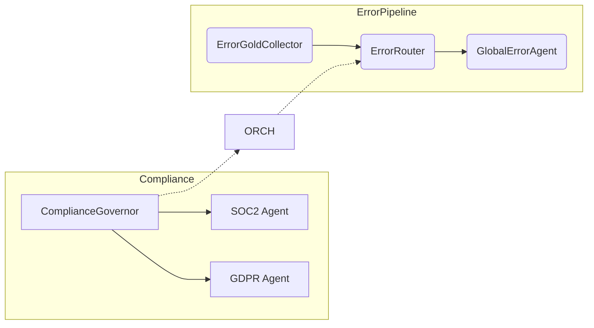

# System Architecture

```mermaid
flowchart TD
    subgraph Client Tier
        A1[Web UI / SDK (TS)]
    end

    subgraph Edge
        GW(API Gateway) -->|JWT| ORCH[ChiefArchitect Orchestrator]
    end

    subgraph Core Services
        ORCH -->|gRPC| LB[Framework Router]
        LB -->|Route Task| AGPOOL{{Agent Pool}}
        AGPOOL -->|Process| AG1[Specialist\nAgents]
        AGPOOL --> AG2[Guardian\nAgents]
        AGPOOL --> AG3[Processing\nAgents]
        AGPOOL --> AG4[Interface\nAgents]
        AGPOOL --> ORCH
        ORCH -->|Errors| EG[ErrorGold SDK]
        ORCH -->|Trace| OTEL[(OpenTelemetry Collector)]
        ORCH -->|RAG Query| RET[Retriever Service]
    end

    subgraph Data Plane
        RET --> VEC[(Qdrant Vector DB)]
        RET --> GRAPH[(Neo4j Knowledge Graph)]
        RET --> CACHE[(Redis Memory Cache)]
    end

    classDef gray fill:#f7f7f7,stroke:#ccc,stroke-width:1px;
    class GW,LB,OTEL gray;
``` 

## Layers
1. **Edge Layer** – API gateway validates JWT/mTLS before forwarding to orchestrator.
2. **Core Services** – ChiefArchitect orchestrator (LangGraph) delegates tasks via FrameworkRouter (weighted response time LB). ErrorGold intercepts exceptions, OTEL exports traces.
3. **Data Plane** – Retriever Service abstracts the hybrid datastore to provide vector, graph, and cache lookups for RAG.

## Deployment
* Kubernetes with Istio service mesh for mTLS & observability.
* Docker-Compose stack for local dev (`devops/docker-compose.yaml`).

## Future Extensions
* Auto-scaling agents with KEDA.
* Streaming pub/sub via NATS.
* Optional GPU inference pods for local LLMs (vLLM).

---
*Diagram last updated*: 2024-06-17 

## Compliance & Observability Extension (2025-07)

New layers have been modelled to capture cross-cutting concerns:

1. **ComplianceGovernor & Agents** – orchestrates SOC-2/GDPR/HIPAA validation and evidence collection (see `newdiagram.md`).
2. **Error Pipeline 2.0** – `ErrorGoldCollector → ErrorRouter → GlobalErrorAgent` for auto-remediation (see `newdiagram_v2.md`).
3. **Metrics & Dashboards** – Prometheus + Grafana panels for embedding batch latency, Neo4j queries, retriever hybrid reranker.



*Full class diagrams live in the linked markdown files and are rendered in the docs site.* 