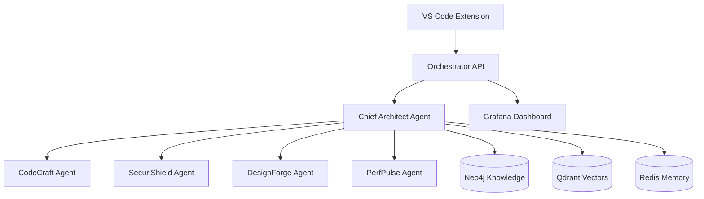

# Quick Start

Get Constella up and running in just a few minutes! This guide will walk you through the essential steps to deploy the platform and start orchestrating AI agents.

## Prerequisites

Before you begin, ensure you have:

- **Docker & Docker Compose** (v20.10+ recommended)
- **Node.js 18+** (for VS Code extension)
- **8GB RAM minimum** (16GB recommended)
- **10GB free disk space**
- **Git** for cloning the repository

## 🚀 Step 1: Deploy the Platform

### Clone the Repository
```bash
git clone https://github.com/constella-ai/constella.git
cd constella
```

### One-Command Deployment
```bash
# Deploy entire platform with development configuration
./scripts/deploy.sh

# Or deploy for production
ENVIRONMENT=production ./scripts/deploy.sh
```

The deployment script will:
- Pull all required Docker images
- Set up the knowledge graph (Neo4j)
- Initialize vector database (Qdrant)
- Configure Redis memory system
- Start all specialized agents
- Launch the orchestrator API

### Verify Deployment
```bash
# Check all services are running
./scripts/monitor.sh

# Test the orchestrator API
curl http://localhost:8000/health
```

You should see output confirming all services are healthy.

## 🔧 Step 2: Install VS Code Extension

### Install Extension
```bash
cd interfaces/vscode-extension
npm install
npm run compile

# Install the extension
code --install-extension .
```

### Configure Extension
1. Open VS Code Settings (`Cmd/Ctrl + ,`)
2. Search for "Constella"
3. Configure the following settings:
   - **Orchestrator URL**: `http://localhost:8000`
   - **Project ID**: Your project identifier
   - **Tech Stack**: Select your technologies

## 🎯 Step 3: Your First AI Orchestration

### Using VS Code Extension

1. **Open any project** in VS Code
2. **Press `Ctrl+Shift+C O`** to open the orchestrator
3. **Type your request**: 
   ```
   "Add JWT authentication with role-based access control to my Express.js API"
   ```
4. **Watch the magic happen**: 
   - Chief Architect analyzes your request
   - Breaks it into subtasks
   - Assigns specialized agents
   - Coordinates implementation

### Using the API Directly

```bash
# Send a task to the orchestrator
curl -X POST http://localhost:8000/orchestrate \
  -H "Content-Type: application/json" \
  -d '{
    "task": "Implement user authentication system",
    "type": "feature_development",
    "context": {
      "framework": "express",
      "language": "typescript"
    }
  }'
```

## 🔍 Step 4: Monitor Progress

### Real-time Monitoring
- **Grafana Dashboard**: http://localhost:3002 (admin/admin)
- **Agent Status**: http://localhost:8000/agents/status
- **WebSocket Events**: Available in VS Code sidebar

### View Logs
```bash
# View orchestrator logs
docker-compose logs -f orchestrator-py

# View specific agent logs
docker-compose logs -f codecraft
```

## 🎮 Common Use Cases

### Feature Development
```bash
# Via VS Code: Ctrl+Shift+C F
"Add user registration with email verification"
```

### Bug Fixing
```bash
# Right-click on buggy code in VS Code
> Constella: AI Bug Fix
"Fix memory leak in session handling"
```

### Security Audit
```bash
# Folder context menu in VS Code
> Constella: Security Audit
# Runs comprehensive security scan automatically
```

### Performance Optimization
```bash
# Select slow code and use:
> Constella: Optimize Performance
"Optimize database queries for better response times"
```

## 🔧 Essential Commands

### Service Management
```bash
# Start all services
docker-compose -f docker-compose.dev.yml up -d

# Stop all services
docker-compose -f docker-compose.dev.yml down

# Restart specific service
docker-compose -f docker-compose.dev.yml restart codecraft

# View service status
docker-compose ps
```

### Health Checks
```bash
# Check orchestrator health
curl http://localhost:8000/health

# Check all agent capabilities
curl http://localhost:8000/capabilities

# Test WebSocket connection
wscat -c ws://localhost:8000/ws -x '{"type":"ping"}'
```

### Development Utilities
```bash
# Run comprehensive tests
./scripts/test.sh

# Monitor all services
./scripts/monitor.sh

# View detailed metrics
curl http://localhost:8000/metrics
```

## 🏗️ Architecture Overview



## 🎯 Next Steps

Now that you have Constella running:

1. **📚 [Learn Core Concepts](/core-concepts/overview)** - Understand how agents work together
2. **🛠️ [Developer Guides](/development/guides/setup)** - Deep dive into development workflows  
3. **🏢 [Enterprise Setup](/enterprise/deployment/production)** - Production deployment guide
4. **🤝 [Join Community](/community/overview)** - Connect with other users

## 🔧 Troubleshooting

### Services Won't Start
```bash
# Check Docker daemon
docker info

# Check port conflicts
netstat -tulpn | grep 8000

# View startup logs
docker-compose logs orchestrator-py
```

### VS Code Extension Issues
```bash
# Verify orchestrator connectivity
curl http://localhost:8000/health

# Check extension logs
# Open VS Code Developer Tools: Help > Toggle Developer Tools
```

### Performance Issues
```bash
# Monitor resource usage
docker stats

# Check system resources
free -h
df -h
```

## 💡 Pro Tips

- **Use descriptive task descriptions** - The more context you provide, the better the results
- **Start with small tasks** - Build up to complex workflows as you learn the system
- **Monitor agent conversations** - Watch how agents collaborate in the VS Code sidebar
- **Leverage templates** - Use built-in patterns for common development tasks
- **Customize workflows** - Adjust agent behavior for your specific needs

## 🆘 Need Help?

- **📖 [Documentation](/core-concepts/overview)** - Comprehensive guides
- **💬 [Discord Community](https://discord.gg/constella)** - Real-time support
- **🐛 [GitHub Issues](https://github.com/constella-ai/constella/issues)** - Bug reports
- **📧 [Contact Support](mailto:support@constella.ai)** - Direct assistance

---

**Ready to revolutionize your development workflow?** Start with a simple task and watch Constella's AI agents transform how you build software! 🚀